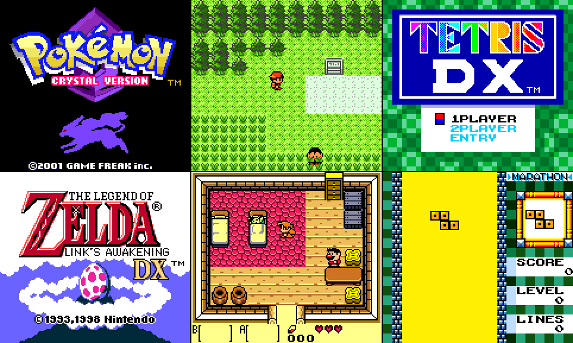



## BasicBoy \- A Game boy Color emulator

### Description

BasicBoy is A gameboy emulator coded in Visual Basic (+Api+dx).Currently it Suports

GameBoy(85%) /GameBoy Color(75%)

There are some bugs with the timing(help needed)

It can run at 200-320% on my old pc

(p3 600mhz,Gf4200,WinXP pro)

No Sound support (Will Be added)

Beta Testers are Needed...

Sound help is needed too...

Please Vote and post Speed/Bugs
 
### More Info
 

             |
---                |---
**Submitted On**   |2003-09-08 18:38:16
**By**             |[Raziel](https://github.com/Planet-Source-Code/PSCIndex/blob/master/ByAuthor/raziel.md)
**Level**          |Advanced
**User Rating**    |4.5 (172 globes from 38 users)
**Compatibility**  |VB 5\.0, VB 6\.0
**Category**       |[Miscellaneous](https://github.com/Planet-Source-Code/PSCIndex/blob/master/ByCategory/miscellaneous__1-1.md)
**World**          |[Visual Basic](https://github.com/Planet-Source-Code/PSCIndex/blob/master/ByWorld/visual-basic.md)
**Archive File**   |[BasicBoy\_\-1646679172003\.zip](https://github.com/Planet-Source-Code/raziel-basicboy-a-game-boy-color-emulator__1-48588/archive/master.zip)

